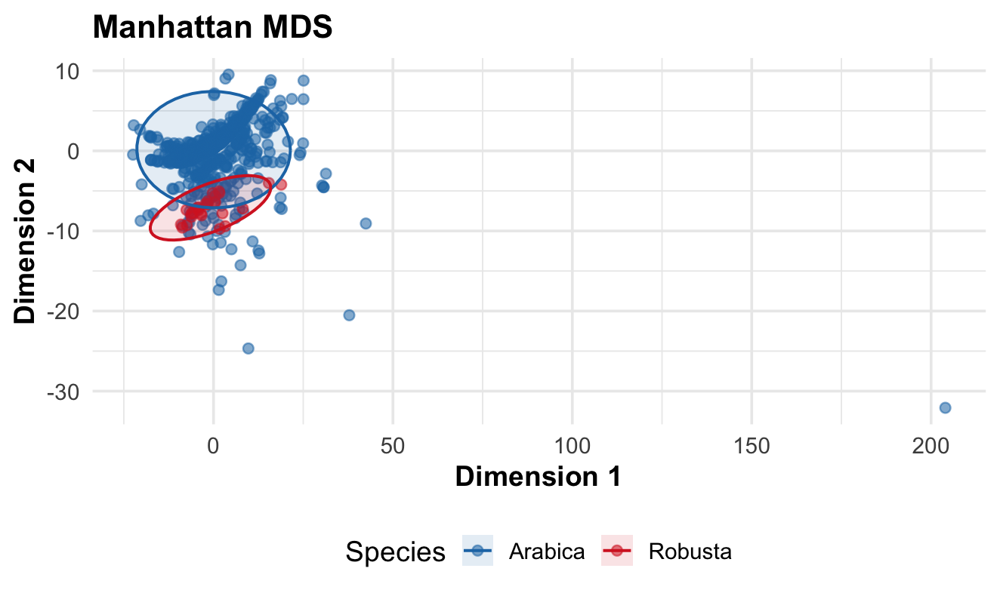
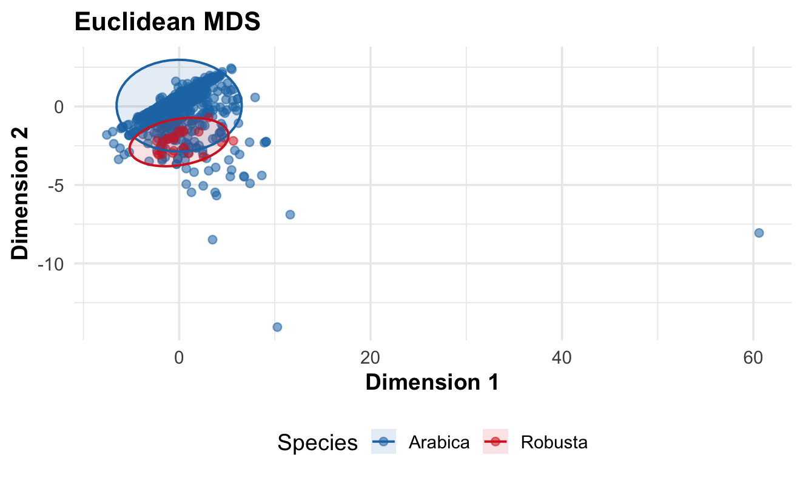
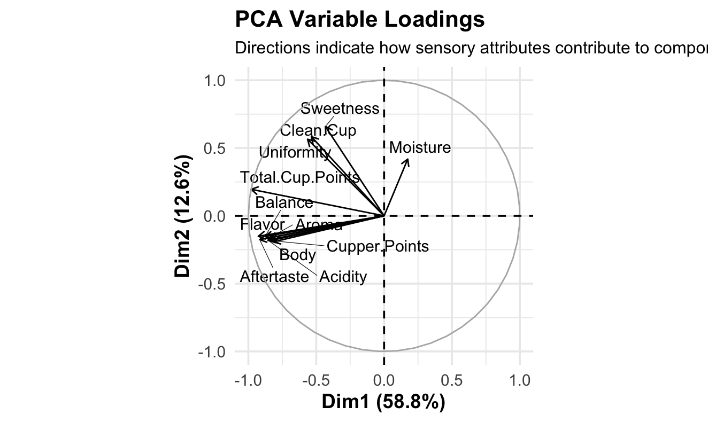
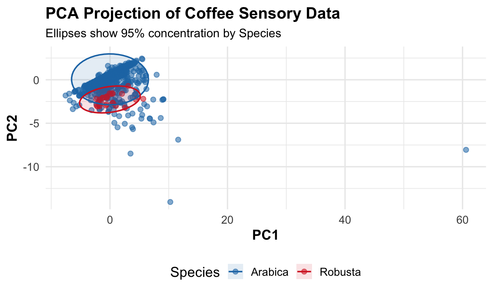
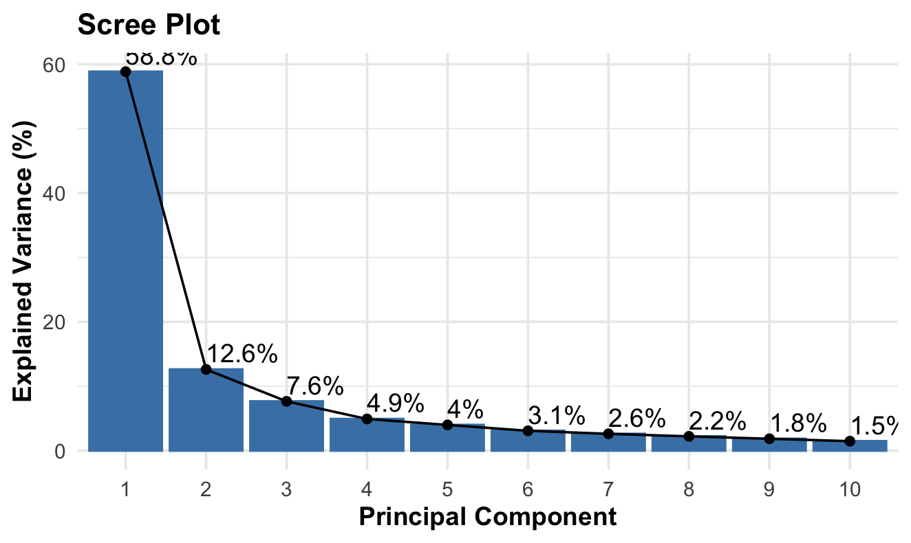
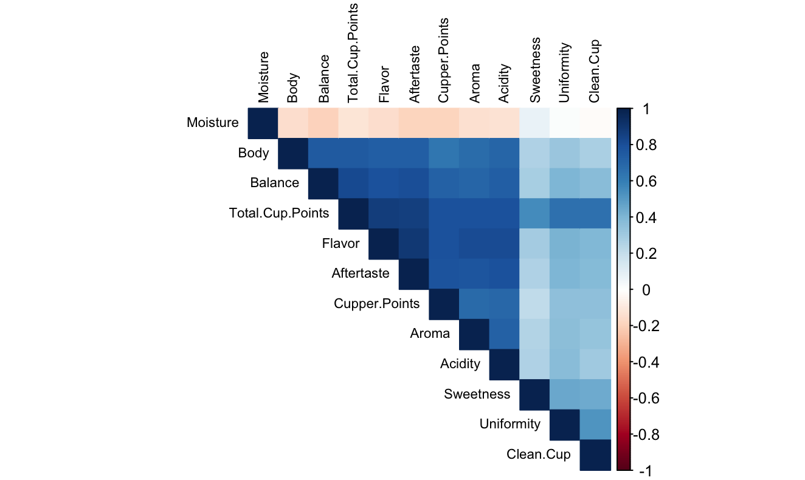

# Coffee Sensory Analysis using PCA and MDS

This project explores coffee sensory characteristics using dimensionality reduction techniques in R.

The objective is to analyze relationships between sensory attributes and visualize patterns among coffee samples using unsupervised learning methods.

---

## Dataset

The dataset contains sensory evaluation scores for coffee samples, including attributes such as:

- Aroma
- Flavor
- Aftertaste
- Acidity
- Body
- Balance
- Sweetness
- Uniformity
- Clean Cup
- Total Cup Points

The analysis includes both **Arabica** and **Robusta** coffee samples.

---

## Methods Used

The following unsupervised learning and exploratory techniques were applied:

- Correlation Analysis
- Principal Component Analysis (PCA)
- Scree Plot Analysis
- PCA Variable Loadings
- Multidimensional Scaling (MDS)
  - Euclidean distance
  - Manhattan distance

---

## Correlation Matrix

The correlation heatmap shows strong positive relationships between several sensory attributes such as **Flavor, Aftertaste, Balance, and Total Cup Points**.

---

## Scree Plot

The scree plot indicates that the **first principal component explains a large portion of the variance (~58.8%)**, suggesting that most sensory variability can be summarized with a small number of components.

---

## PCA Projection

The PCA projection visualizes coffee samples in a reduced 2D space. Ellipses represent the **95% concentration region** for each species.

This projection reveals noticeable clustering patterns between **Arabica and Robusta** samples.

---

## PCA Variable Loadings

The loading plot illustrates how sensory attributes contribute to the principal components. Attributes such as **Flavor, Body, Acidity, and Aftertaste** strongly influence the first component.

---

## Multidimensional Scaling (Euclidean)

Euclidean MDS provides an alternative visualization of the similarity structure among coffee samples.

---

## Multidimensional Scaling (Manhattan)

Using Manhattan distance produces a slightly different spatial representation but preserves the general separation patterns between species.

---

## Tools & Libraries

- R
- dplyr
- ggplot2
- corrplot
- factoextra

---

## Project Structure
